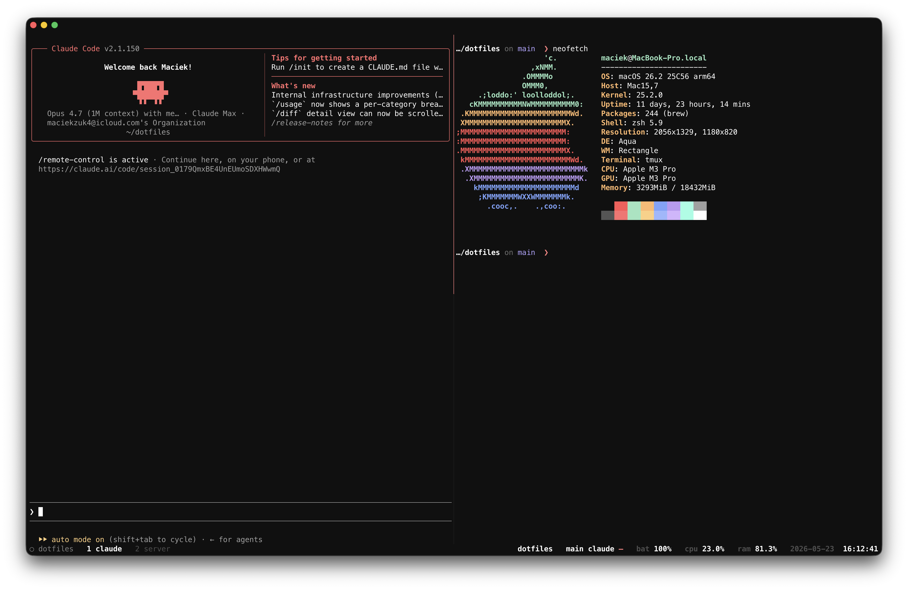

# dotfiles — tmux + ghostty

My personal terminal setup for macOS — minimal Vesper-themed tmux, vim-style
navigation, Ghostty as the host terminal.



## Install

```bash
git clone <repo-url> ~/.tmux
~/.tmux/install.sh
# Open tmux, then press Ctrl+Space I to install plugins.
```

The install script symlinks `~/.tmux.conf` and `~/.config/ghostty/config`,
backs up any existing files, and installs TPM.

## Status bar

```
○ session  ▸ dir +ins -del  claude 5h: 42% (2h 30m)  7d: 8% (4d 12h)  battery 90% ●  cpu 12%  ram 38%  2026-05-23 15:42
```

- **Left** — session name. Filled circle (●) when prefix is active.
- **Right** — cwd + git diff stats, Claude API usage (5h / 7d caps,
  with time-to-reset in parens), battery (green dot ● when charging),
  cpu, ram, date/time.
- Percentages are color-coded: green <60%, orange 60–84%, red ≥85%
  (battery inverted: red ≤15%, orange ≤40%, green otherwise).

## Keybindings

Prefix: **`Ctrl+Space`**

### Navigation
| Key | Action |
|-----|--------|
| `h` `j` `k` `l` | Select pane (left/down/up/right) |
| `H` `J` `K` `L` | Resize pane (repeatable) |
| `Option+1..5` | Jump to window 1–5 (no prefix) |

### Windows & panes
| Key | Action |
|-----|--------|
| `\` | Split horizontally (preserves cwd) |
| `-` | Split vertically (preserves cwd) |
| `c` | New window (preserves cwd) |
| `b` | Toggle status bar |
| `r` | Reload config |

### Layouts
| Key | Action |
|-----|--------|
| `@` | 2 equal columns |
| `#` | 3 equal columns |
| `D` | Dev — 3× Claude (top 70%) + terminal (bottom 30%) |

### Tools
| Key | Action |
|-----|--------|
| `g` | Lazygit popup |
| `s` | Sesh — fuzzy session picker |
| `F` | tmux-fzf |
| `Space` | tmux-thumbs (Colemak homerow hints) |

### Copy mode (vi)
| Key | Action |
|-----|--------|
| `v` | Begin selection |
| `y` | Yank to system clipboard |

## Structure

```
~/.tmux/
├── tmux.conf            # main config (symlinked to ~/.tmux.conf)
├── ghostty/config       # ghostty config (symlinked to ~/.config/ghostty/config)
├── install.sh           # setup script
├── layouts/             # pane layout scripts (2col, 3col, dev)
├── scripts/             # status-bar helpers
│   ├── dir-git-status.sh    # cwd + git stats
│   ├── gitmux.sh            # gitmux wrapper
│   ├── claude-usage.sh      # Claude API caps readout
│   └── claude_usage_api.py  # background fetcher (writes /tmp cache)
└── plugins/             # TPM-managed, git-ignored
```

## Plugins

Managed by [TPM](https://github.com/tmux-plugins/tpm):

- `tmux-battery`, `tmux-cpu` — battery / cpu / ram in status bar
- `vim-tmux-navigator` — seamless vim ↔ tmux navigation
- `tmux-resurrect` + `tmux-continuum` — auto-save/restore sessions
- `tmux-fzf` — fzf-driven actions
- `tmux-thumbs` — hint-based copy
- `tmux-which-key` — discoverable keybindings

## Dependencies

Required: `tmux ≥ 3.2`, a [Nerd Font](https://www.nerdfonts.com/) (config uses
MesloLGS Nerd Font Mono).

Optional (status bar / popups degrade gracefully if missing):

```bash
brew install gitmux fzf lazygit
brew install joshmedeski/sesh/sesh
```
