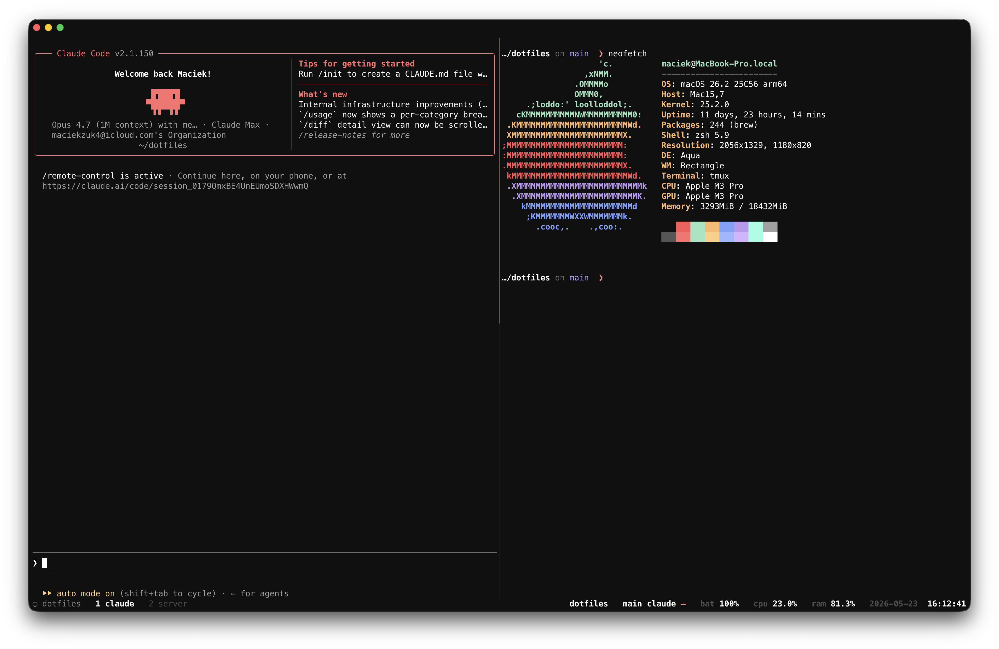

# dotfiles — tmux + ghostty

My personal terminal setup for macOS — minimal Vesper-themed tmux, vim-style
navigation, Ghostty as the host terminal.



## Install

```bash
git clone <repo-url> ~/.tmux
~/.tmux/install.sh
# Open tmux, then press Ctrl+Space I to install plugins.
```

The install script symlinks `~/.tmux.conf` and `~/.config/ghostty/config`,
backs up any existing files, and installs TPM.

## Status bar

```
○ session  Song Title — Artist  1:16 / 3:53  ▸ dir +ins -del  claude 5h: 42% (2h 30m)  7d: 8% (4d 12h)  battery 90% ●  cpu 12%  ram 38%  2026-05-23 15:42
```

- **Left** — session name. Filled circle (●) when prefix is active.
- **Right** — now-playing track, cwd + git diff stats, Claude API usage
  (5h / 7d caps, with time-to-reset in parens), battery (green dot ● when
  charging), cpu, ram, date/time.
- **Now playing** — title, artist and `elapsed / total` for whatever
  Music.app / Spotify is playing (dimmed when paused). Silent when nothing
  is running; never launches a player.
- Percentages are color-coded: green <60%, orange 60–84%, red ≥85%
  (battery inverted: red ≤15%, orange ≤40%, green otherwise).

## Claude window dot

A `●` appears next to a window in the window list when a Claude Code pane in
that window needs attention:

- **green ● `#87d787`** — Claude finished a task (`Stop` hook)
- **orange ● `#ffaf5f`** — Claude is waiting for you, e.g. a permission prompt
  (`Notification` hook)

It clears the moment you focus the window (`pane-focus-in` hook). A window
you're actively viewing (active window of an *attached* session) never gets a
dot — `claude-tmux-notify.sh` skips it.

**Cross-session:** the dot only shows in the *current* session's window list,
so the same flag drives three more cross-session cues:

- a tmux status-bar **flash** (`display-message`) on every attached client when
  the hook fires, naming the `session:window` — pure tmux, no macOS banners;
- a `●` next to the **session name** in `status-left` when *another* session
  has a pending Claude (`claude-other-sessions.sh` — orange if any is waiting,
  else green);
- **`sesh` picker coloring** — `prefix + s` lists sessions with a pending Claude
  in color (orange waiting / green done) via `sesh-list-claude.sh`, so you see
  at a glance which one to jump to.

Wiring lives **outside this repo** in `~/.claude/settings.json` (the `Stop` and
`Notification` hooks call `~/.tmux/scripts/claude-tmux-notify.sh done|waiting`).
The hook reads `$TMUX_PANE` to know which window/session to flag.

## `net` widget — link speed and signal

The `net` segment in `status-right` answers three questions at a glance:

```
net ↓1,2M ↑84K ▁▄█ -47 │ 115↓/38↑
    └ live throughput  └ signal  └ last speedtest
```

- **Throughput** — byte-counter deltas from `netstat -ibn` on the default-route
  interface, divided by the real elapsed time (tmux refreshes the bar off
  schedule too). Brightness ramps with volume — dim when idle, white under
  traffic, coral above 5 MB/s. Deliberately *not* the green/amber/red palette:
  those mean healthy/unhealthy here, and 0 B/s at night is not a fault.
  Columns are counted from the end (`$(NF-4)`, `$(NF-1)`) because the `<Link`
  row for `ppp0`/`utun0` has no Address column — left-to-right indexing would
  break exactly while the VPN is up.
- **Signal** — three fixed cells plus dBm, thresholds identical to
  `wifi-survey.sh` so the two never disagree. Shown whenever Wi-Fi is
  associated, regardless of routing: on VPN the default route is `ppp0` but
  you are still physically on Wi-Fi. Ethernet or radio off → it disappears.
- **Speedtest** — appears only for 10 minutes after a measurement, then goes
  away. A number parked there permanently would keep asserting that a
  three-day-old reading is current; the full result with a timestamp lives in
  `prefix + N → Szczegóły`.

`prefix + N` opens the network menu: on-demand speedtest, connection details
(band, channel, width, PHY, noise, SNR, link rate, SSID, gateway), and the
room survey below. `prefix + W` toggles the segment like any other widget.

RSSI arrives through `scripts/wifi-rssi-daemon.sh`, which keeps one long-lived
sampler alive and writes each reading atomically to `/tmp/tmux-wifi-rssi`. The
widget only stats and reads that file. This indirection is not optional: the
`#!/usr/bin/env swift` shebang recompiles the sampler on **every** run — 2.6 s
measured — so calling it once per second would freeze the status bar. The
daemon starts lazily from the widget when the cache goes stale, so there is no
install step and it recovers on its own.

`scripts/net-speed.sh --self-test` checks the pure functions (byte formatting,
dBm→bars mapping, expiry, division by a zero-length window, counter resets).

## Wi-Fi survey

`scripts/wifi-survey.sh` measures Wi-Fi signal room by room — carry the laptop
around, type a room name, hit Enter, stand still for ten seconds. It stores
median / min / max for that room and, on `q`, prints the rooms ranked
best-to-worst into your scrollback.

```bash
scripts/wifi-survey.sh                     # 10 s per room
scripts/wifi-survey.sh --window 20         # longer sample per room
scripts/wifi-survey.sh --stats-test        # self-check of the maths
```

Median rather than mean, because dBm is logarithmic and one dropout would drag
an average several dB. `min` matters more than the median for "does streaming
survive here" — a room that typically sits at −55 but dips to −80 will stutter.

Rough scale: `−50` and above excellent, `−60` good, `−67` usable, below `−75`
barely works.

Readings come from `scripts/wifi-rssi.swift`, a CoreWLAN sampler — **no sudo**.
macOS 26 deleted the `airport` binary, `wdutil info` needs root, and
`system_profiler SPAirPortDataType` takes 7–9 s per call because it rescans the
whole neighbourhood, so CoreWLAN is the only fast, unprivileged source left.
It needs `swift` (Xcode or Command Line Tools). The network *name* comes from
`ipconfig` instead — SSID via CoreWLAN would require Location Services, while
signal strength does not.

The TUI is zsh, not bash, because its render loop needs sub-second non-blocking
reads and macOS still ships bash 3.2, whose `read -t` rejects fractional
timeouts.

## Keybindings

Prefix: **`Ctrl+Space`**

### Navigation
| Key | Action |
|-----|--------|
| `h` `j` `k` `l` | Select pane (left/down/up/right) |
| `H` `J` `K` `L` | Resize pane (repeatable) |
| `Option+1..5` | Jump to window 1–5 (no prefix) |

### Windows & panes
| Key | Action |
|-----|--------|
| `\` | Split horizontally (preserves cwd) |
| `-` | Split vertically (preserves cwd) |
| `c` | New window (preserves cwd) |
| `b` | Toggle status bar |
| `W` | Widgets menu — toggle individual status-right segments |
| `N` | Network menu — speedtest, connection details, room survey |
| `r` | Reload config |

### Layouts
| Key | Action |
|-----|--------|
| `@` | 2 equal columns |
| `#` | 3 equal columns |
| `D` | Dev — 3× Claude (top 70%) + terminal (bottom 30%) |

### Tools
| Key | Action |
|-----|--------|
| `g` | Lazygit popup |
| `s` | Sesh — fuzzy session picker |
| `F` | tmux-fzf |
| `Space` | tmux-thumbs (Colemak homerow hints) |

### Copy mode (vi)
| Key | Action |
|-----|--------|
| `v` | Begin selection |
| `y` | Yank to system clipboard |

## Structure

```
~/.tmux/
├── tmux.conf            # main config (symlinked to ~/.tmux.conf)
├── ghostty/config       # ghostty config (symlinked to ~/.config/ghostty/config)
├── install.sh           # setup script
├── layouts/             # pane layout scripts (2, 3, 8, 8c, dev)
├── scripts/             # status-bar helpers
│   ├── dir-git-status.sh    # cwd + git stats
│   ├── gitmux.sh            # gitmux wrapper
│   ├── music.sh            # now-playing (Music.app / Spotify via AppleScript)
│   ├── claude-usage.sh      # Claude API caps readout
│   ├── claude_usage_api.py  # background fetcher (writes /tmp cache)
│   ├── claude-tmux-notify.sh   # flags a window's dot + flash from Claude hooks
│   ├── claude-other-sessions.sh # status-left dot when another session pends
│   └── sesh-list-claude.sh     # colorizes the sesh picker by Claude state
│   ├── net-speed.sh            # widget: throughput, signal, fresh speedtest
│   ├── net-ctl.sh              # prefix+N actions: speedtest / details / survey
│   ├── wifi-rssi-daemon.sh     # keeps the sampler alive, writes the RSSI cache
│   ├── wifi-survey.sh          # room-by-room Wi-Fi signal survey (zsh TUI)
│   ├── wifi-rssi.swift         # CoreWLAN RSSI sampler feeding wifi-survey.sh
└── plugins/             # TPM-managed, git-ignored
```

## Plugins

Managed by [TPM](https://github.com/tmux-plugins/tpm):

- `tmux-battery`, `tmux-cpu` — battery / cpu / ram in status bar
- `vim-tmux-navigator` — seamless vim ↔ tmux navigation
- `tmux-resurrect` + `tmux-continuum` — auto-save/restore sessions
- `tmux-fzf` — fzf-driven actions
- `tmux-thumbs` — hint-based copy
- `tmux-which-key` — discoverable keybindings

## Dependencies

Required: `tmux ≥ 3.2`, a [Nerd Font](https://www.nerdfonts.com/) (config uses
MesloLGS Nerd Font Mono).

Optional (status bar / popups degrade gracefully if missing):

```bash
brew install gitmux fzf lazygit
brew install joshmedeski/sesh/sesh
```
